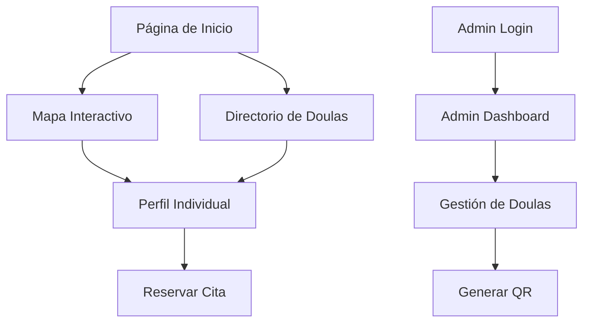

# Documento de Requerimientos del Producto - encuentratudoula.com

## 1. Descripción General del Producto

encuentratudoula.com es una plataforma web completa que funciona como un directorio global e interactivo para doulas graduadas de la "Escuela Mística de Saberes". La plataforma permite a los visitantes encontrar, contactar y reservar citas con doulas a través de perfiles individuales y un mapa interactivo mundial.

El objetivo principal es conectar a las doulas certificadas con clientes potenciales de manera eficiente, proporcionando una experiencia de usuario intuitiva tanto para la búsqueda como para la reserva de servicios.

## 2. Características Principales

### 2.1 Roles de Usuario

| Rol | Método de Registro | Permisos Principales |
|-----|-------------------|---------------------|
| Visitante | No requiere registro | Puede navegar, buscar doulas, ver perfiles y reservar citas |
| Administrador | Credenciales proporcionadas por la escuela | Gestión completa de perfiles de doulas, acceso al panel administrativo |

### 2.2 Módulos de Funcionalidad

Nuestra plataforma de directorio de doulas consta de las siguientes páginas principales:

1. **Página de Inicio**: mapa interactivo mundial, buscador de doulas, sección introductoria, navegación al directorio.
2. **Directorio de Doulas**: vista de cuadrícula de doulas, filtros de búsqueda, tarjetas de perfil resumidas.
3. **Perfil Individual de Doula**: galería de fotos, biografía completa, servicios detallados, formulario de contacto, calendario de reservas, mapa de ubicación.
4. **Panel de Administración - Login**: formulario de autenticación segura para administradores.
5. **Panel de Administración - Dashboard**: listado de doulas, operaciones CRUD, gestión de perfiles, generación de códigos QR.

### 2.3 Detalles de Páginas

| Nombre de Página | Nombre del Módulo | Descripción de Funcionalidad |
|------------------|-------------------|------------------------------|
| Página de Inicio | Mapa Interactivo | Mostrar mapa mundial con marcadores de doulas activas, clustering de marcadores, popups informativos al hacer clic |
| Página de Inicio | Buscador Principal | Permitir búsqueda por nombre o ciudad, filtros básicos, navegación rápida |
| Página de Inicio | Sección Introductoria | Presentar la plataforma, enlace al directorio completo, información de la escuela |
| Directorio de Doulas | Vista de Cuadrícula | Mostrar tarjetas con foto, nombre, ciudad y especialidades principales de cada doula |
| Directorio de Doulas | Sistema de Filtros | Filtrar por país, ciudad, especialidad, disponibilidad |
| Directorio de Doulas | Búsqueda Avanzada | Buscar por múltiples criterios, ordenamiento de resultados |
| Perfil Individual | Galería de Fotos | Mostrar múltiples imágenes de la doula, navegación entre fotos |
| Perfil Individual | Información Personal | Mostrar nombre completo, biografía detallada, especialidades |
| Perfil Individual | Sistema de Contacto | Formulario que envía emails directos a la doula |
| Perfil Individual | Calendario de Reservas | Integración con Calendly o sistema similar para reservar citas |
| Perfil Individual | Mapa de Ubicación | Mostrar ubicación específica de la doula en mapa pequeño |
| Admin Login | Autenticación | Validar credenciales de administrador con JWT |
| Admin Dashboard | Gestión de Doulas | Crear, leer, actualizar y eliminar perfiles de doulas |
| Admin Dashboard | Subida de Imágenes | Cargar foto de perfil y galería de fotos |
| Admin Dashboard | Geolocalización | Convertir direcciones en coordenadas automáticamente |
| Admin Dashboard | Generación QR | Crear códigos QR para URLs de perfiles públicos |

## 3. Proceso Principal

### Flujo de Usuario Visitante
Los visitantes ingresan a la página de inicio donde pueden explorar el mapa interactivo para ver doulas cercanas o usar el buscador para encontrar doulas específicas. Desde el mapa o el directorio, pueden acceder a perfiles individuales donde encuentran información detallada y pueden reservar citas directamente a través del calendario integrado.

### Flujo de Administrador
Los administradores acceden a través del login seguro al panel de administración donde pueden gestionar todos los perfiles de doulas. Pueden crear nuevos perfiles, actualizar información existente, subir imágenes, y generar códigos QR para promoción.

## 4. Diseño de Interfaz de Usuario

### 4.1 Estilo de Diseño

- **Colores primarios**: Tonos tierra y naturales (#8B4513 marrón, #228B22 verde bosque)
- **Colores secundarios**: Crema (#F5F5DC) y dorado suave (#DAA520)
- **Estilo de botones**: Redondeados con sombras suaves, efectos hover
- **Fuente**: Inter o similar, tamaños 14px-18px para texto, 24px-32px para títulos
- **Estilo de layout**: Diseño basado en tarjetas, navegación superior fija
- **Iconos**: Estilo minimalista, iconos de maternidad y bienestar

### 4.2 Resumen de Diseño de Páginas

| Nombre de Página | Nombre del Módulo | Elementos de UI |
|------------------|-------------------|----------------|
| Página de Inicio | Mapa Interactivo | Mapa a pantalla completa, marcadores personalizados, barra de búsqueda flotante, colores tierra |
| Página de Inicio | Sección Introductoria | Hero section con imagen de fondo, texto superpuesto, botones CTA redondeados |
| Directorio de Doulas | Vista de Cuadrícula | Tarjetas con bordes redondeados, imágenes circulares, tags de especialidades coloridos |
| Directorio de Doulas | Filtros | Sidebar con checkboxes estilizados, dropdown menus, botón de limpiar filtros |
| Perfil Individual | Galería | Carousel de imágenes, thumbnails, modal de vista ampliada |
| Perfil Individual | Información | Layout de dos columnas, tipografía jerárquica, iconos descriptivos |
| Perfil Individual | Calendario | Widget de Calendly embebido, botón de reserva prominente |
| Admin Dashboard | Tabla de Doulas | DataTable responsive, botones de acción coloridos, modal de confirmación |
| Admin Dashboard | Formularios | Campos con labels flotantes, validación visual, botones de guardar destacados |

### 4.3 Responsividad

La plataforma está diseñada con enfoque mobile-first, adaptándose perfectamente a dispositivos móviles, tablets y desktop. Se incluye optimización para interacciones táctiles en el mapa y formularios.
