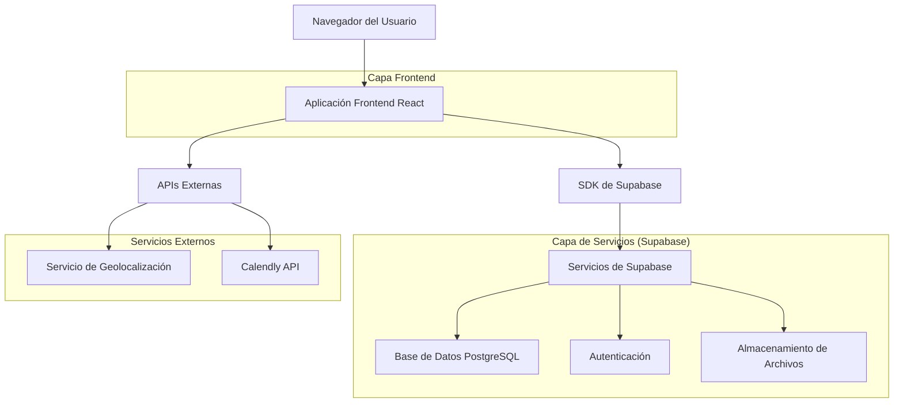
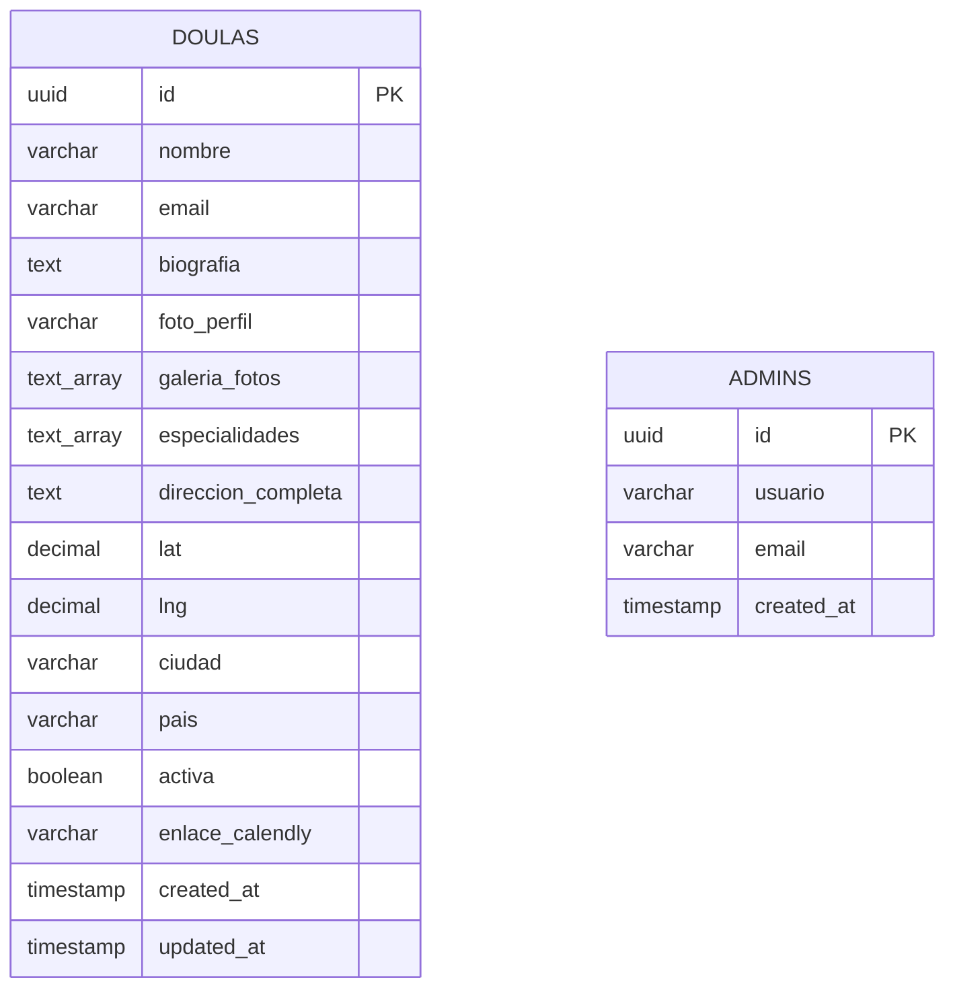

# Documento de Arquitectura Técnica - encuentratudoula.com

## 1. Diseño de Arquitectura



## 2. Descripción de Tecnologías

- **Frontend**: React@18 + Vite + React Router@6 + Tailwind CSS@3
- **Mapa**: Leaflet.js + react-leaflet
- **Base de Datos**: Supabase (PostgreSQL)
- **Autenticación**: Supabase Auth
- **Almacenamiento**: Supabase Storage
- **Códigos QR**: qrcode.react
- **Geolocalización**: OpenCage Geocoding API
- **Calendario**: Integración con Calendly

## 3. Definiciones de Rutas

| Ruta | Propósito |
|------|----------|
| / | Página de inicio con mapa interactivo y búsqueda principal |
| /doulas | Directorio completo de doulas con filtros y búsqueda avanzada |
| /doula/:id | Perfil individual de doula con información detallada y calendario |
| /admin/login | Página de autenticación para administradores |
| /admin/dashboard | Panel de administración para gestión de doulas |
| /admin/doula/new | Formulario para crear nueva doula |
| /admin/doula/:id/edit | Formulario para editar doula existente |

## 4. Definiciones de API

### 4.1 API Principal de Supabase

**Obtener todas las doulas activas**
```sql
SELECT * FROM doulas WHERE activa = true
```

**Obtener doula por ID**
```sql
SELECT * FROM doulas WHERE id = $1
```

**Buscar doulas por criterios**
```sql
SELECT * FROM doulas 
WHERE activa = true 
AND (nombre ILIKE $1 OR ciudad ILIKE $1)
AND ($2 IS NULL OR especialidades && $2)
```

### 4.2 Tipos de Datos TypeScript

```typescript
interface Doula {
  id: string;
  nombre: string;
  email: string;
  biografia: string;
  foto_perfil: string;
  galeria_fotos: string[];
  especialidades: string[];
  direccion_completa: string;
  coordenadas: {
    lat: number;
    lng: number;
  };
  ciudad: string;
  pais: string;
  activa: boolean;
  enlace_calendly?: string;
  created_at: string;
  updated_at: string;
}

interface Admin {
  id: string;
  usuario: string;
  email: string;
  created_at: string;
}

interface SearchFilters {
  query?: string;
  pais?: string;
  ciudad?: string;
  especialidades?: string[];
}
```

## 5. Modelo de Datos

### 5.1 Definición del Modelo de Datos



### 5.2 Lenguaje de Definición de Datos

**Tabla de Doulas (doulas)**
```sql
-- Crear tabla de doulas
CREATE TABLE doulas (
    id UUID PRIMARY KEY DEFAULT gen_random_uuid(),
    nombre VARCHAR(255) NOT NULL,
    email VARCHAR(255) UNIQUE NOT NULL,
    biografia TEXT,
    foto_perfil VARCHAR(500),
    galeria_fotos TEXT[],
    especialidades TEXT[],
    direccion_completa TEXT,
    lat DECIMAL(10, 8),
    lng DECIMAL(11, 8),
    ciudad VARCHAR(255),
    pais VARCHAR(255),
    activa BOOLEAN DEFAULT true,
    enlace_calendly VARCHAR(500),
    created_at TIMESTAMP WITH TIME ZONE DEFAULT NOW(),
    updated_at TIMESTAMP WITH TIME ZONE DEFAULT NOW()
);

-- Crear índices para optimizar búsquedas
CREATE INDEX idx_doulas_activa ON doulas(activa);
CREATE INDEX idx_doulas_ciudad ON doulas(ciudad);
CREATE INDEX idx_doulas_pais ON doulas(pais);
CREATE INDEX idx_doulas_coordenadas ON doulas(lat, lng);
CREATE INDEX idx_doulas_especialidades ON doulas USING GIN(especialidades);
CREATE INDEX idx_doulas_nombre ON doulas(nombre);

-- Función para actualizar updated_at automáticamente
CREATE OR REPLACE FUNCTION update_updated_at_column()
RETURNS TRIGGER AS $$
BEGIN
    NEW.updated_at = NOW();
    RETURN NEW;
END;
$$ language 'plpgsql';

CREATE TRIGGER update_doulas_updated_at BEFORE UPDATE ON doulas
    FOR EACH ROW EXECUTE FUNCTION update_updated_at_column();

-- Configurar Row Level Security (RLS)
ALTER TABLE doulas ENABLE ROW LEVEL SECURITY;

-- Política para lectura pública de doulas activas
CREATE POLICY "Doulas activas son visibles públicamente" ON doulas
    FOR SELECT USING (activa = true);

-- Política para administradores (acceso completo)
CREATE POLICY "Administradores tienen acceso completo" ON doulas
    FOR ALL USING (auth.role() = 'authenticated');

-- Permisos para roles
GRANT SELECT ON doulas TO anon;
GRANT ALL PRIVILEGES ON doulas TO authenticated;
```

**Tabla de Administradores (admins)**
```sql
-- Crear tabla de administradores
CREATE TABLE admins (
    id UUID PRIMARY KEY DEFAULT gen_random_uuid(),
    usuario VARCHAR(100) UNIQUE NOT NULL,
    email VARCHAR(255) UNIQUE NOT NULL,
    created_at TIMESTAMP WITH TIME ZONE DEFAULT NOW()
);

-- Configurar RLS para admins
ALTER TABLE admins ENABLE ROW LEVEL SECURITY;

-- Solo usuarios autenticados pueden ver admins
CREATE POLICY "Solo administradores pueden ver admins" ON admins
    FOR ALL USING (auth.role() = 'authenticated');

GRANT ALL PRIVILEGES ON admins TO authenticated;
```

**Datos iniciales**
```sql
-- Insertar administrador inicial
INSERT INTO admins (usuario, email) VALUES 
('admin', 'admin@escuelamistica.com');

-- Insertar doulas de ejemplo
INSERT INTO doulas (
    nombre, email, biografia, especialidades, 
    direccion_completa, lat, lng, ciudad, pais, 
    enlace_calendly, activa
) VALUES 
(
    'María González',
    'maria@example.com',
    'Doula certificada con 5 años de experiencia acompañando familias en su proceso de maternidad.',
    ARRAY['Parto natural', 'Lactancia', 'Postparto'],
    'Calle Principal 123, Madrid, España',
    40.4168,
    -3.7038,
    'Madrid',
    'España',
    'https://calendly.com/maria-gonzalez',
    true
),
(
    'Ana Rodríguez',
    'ana@example.com',
    'Especialista en acompañamiento emocional durante el embarazo y parto.',
    ARRAY['Parto en agua', 'Hipnoparto', 'Duelo perinatal'],
    'Avenida Libertador 456, Buenos Aires, Argentina',
    -34.6118,
    -58.3960,
    'Buenos Aires',
    'Argentina',
    'https://calendly.com/ana-rodriguez',
    true
);
```

**Configuración de Storage para imágenes**
```sql
-- Crear bucket para fotos de doulas
INSERT INTO storage.buckets (id, name, public) VALUES ('doula-photos', 'doula-photos', true);

-- Política para subida de imágenes (solo administradores)
CREATE POLICY "Administradores pueden subir fotos" ON storage.objects
    FOR INSERT WITH CHECK (
        bucket_id = 'doula-photos' AND 
        auth.role() = 'authenticated'
    );

-- Política para lectura pública de imágenes
CREATE POLICY "Fotos son públicamente visibles" ON storage.objects
    FOR SELECT USING (bucket_id = 'doula-photos');
```
